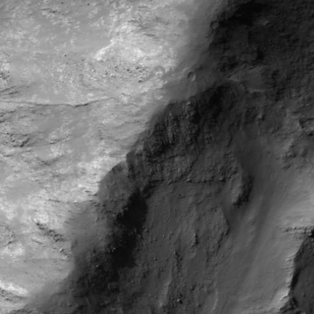
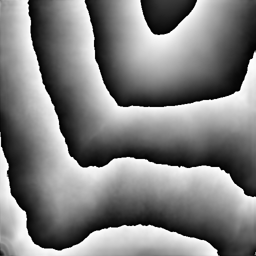

# DTM_3D for Moon Images

## Project Overview

**Project Name:** DTM_3D  
**Author:** Pirate-Emperor

## Description

DTM_3D for Moon Images is an advanced project developed by Pirate-Emperor that specializes in Depth Terrain Estimation for lunar landscapes. This project utilizes cutting-edge computer vision and deep learning techniques to estimate the depth information of terrain from 2D images of the Moon. DTM_3D for Moon Images is designed for applications such as lunar exploration, research, and mission planning.

## Screenshots

## Features

1. **Lunar Terrain Depth Estimation:** DTM_3D utilizes a deep neural network model tailored for lunar images to estimate the depth information of the Moon's terrain from 2D images, providing a detailed 3D representation.

2. **High Precision Lunar Depth Maps:** The model is trained to achieve high precision in depth estimation, capturing the unique features of lunar landscapes with accuracy.

3. **Real-time Processing:** DTM_3D is optimized for real-time processing, allowing rapid and dynamic depth estimation for Moon images.

4. **Customizable Architectures:** Researchers and developers can experiment with different neural network architectures and fine-tune model parameters to adapt the depth estimation for specific lunar scenarios.

5. **Integration Support:** DTM_3D for Moon Images provides APIs and integration support, facilitating seamless incorporation into lunar exploration applications and systems.

## Installation

To install DTM_3D for Moon Images, follow these steps:

1. Clone the repository: `git clone https://github.com/Pirate-Emperor/DTM_3D_Moon.git`
2. Navigate to the project directory: `cd DTM_3D_Moon`
3. Install dependencies: `pip install -r requirements.txt`
4. Download pre-trained models (if available) or train your own using the provided lunar images and scripts.
5. Run the application: `python dtm_3d_moon.py`

## Usage

1. Launch the application by executing `dtm_3d_moon.py`.
2. Input 2D images of the Moon's terrain into the application.
3. Initiate the depth estimation process.
4. Explore the 3D representation of the lunar landscape generated by DTM_3D for Moon Images.
5. Integrate the model into your lunar exploration applications using the provided APIs.

## Contributing

If you're interested in contributing to DTM_3D for Moon Images, please follow the guidelines in the [CONTRIBUTING.md](CONTRIBUTING.md) file.

## License

This project is licensed under the [MIT License](LICENSE).

## Acknowledgments

Check out the configuration reference at https://huggingface.co/docs/hub/spaces-config-reference

